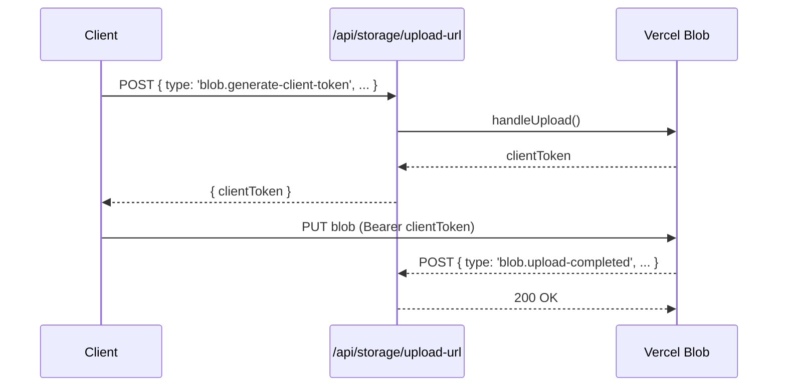

# File Storage Setup

This project ships with a unified file storage abstraction that can back onto either the local filesystem or Vercel Blob. The runtime driver is selected automatically so you can build once and deploy anywhere.

## Driver Selection

The runtime driver is decided by `FILE_STORAGE_TYPE` when it is set (`local`, `vercel-blob`, or `s3`). If the variable is omitted, deployments on Vercel default to Vercel Blob while all other environments fall back to the local filesystem driver.

```mermaid
flowchart LR
  A[FILE_STORAGE_TYPE] -->|set| D((Driver))
  B[IS_VERCEL_ENV]|>|vercel-blob| D
  C[Default] -->|local| D
```

### Environment Variables

```ini
# Defaults already work—uncomment only when you need to override them.

# -- Vercel Blob example --
# FILE_STORAGE_TYPE=vercel-blob
# FILE_STORAGE_PREFIX=uploads
# BLOB_READ_WRITE_TOKEN=<auto on Vercel>
# Pull locally with `vercel env pull` when testing against the real Blob store.

# -- Local filesystem example --
# FILE_STORAGE_TYPE=local
# FILE_STORAGE_PREFIX=uploads
# FILE_STORAGE_LOCAL_PUBLIC_ROOT=./public

# -- S3 (planned driver) --
# FILE_STORAGE_TYPE=s3
# FILE_STORAGE_PREFIX=uploads
# FILE_STORAGE_S3_BUCKET=your-bucket
# FILE_STORAGE_S3_REGION=us-east-1
```

## Local Filesystem Driver

Files are written beneath `<public>/<FILE_STORAGE_PREFIX>/<uuid>/<filename>` (defaults to `uploads/…`) so they can be served as static assets. Metadata is persisted alongside every file (`metadata.json`) to provide size/content type lookups without hitting the filesystem.

Server-side uploads leverage the shared storage interface:

```ts
import { serverFileStorage } from "lib/file-storage";

await serverFileStorage.upload(buffer, {
  filename: "example.png",
  contentType: "image/png",
});

const url = await serverFileStorage.getSourceUrl(key);
```

Direct browser uploads are not exposed for the local driver. The `/api/storage/upload-url` endpoint responds with `501` so you can handle uploads through your own API route or server action.

## Vercel Blob Driver

The Blob driver brings global edge distribution while keeping the same `FileStorage` contract. Uploaded files are public by default and reuse Vercel’s caching behaviour.

### Client Upload Flow

Use the provided `handleUpload` endpoint to obtain a client token and stream the file straight to Vercel Blob. The route automatically prefixes every pathname with `FILE_STORAGE_PREFIX` and adds a random suffix to avoid collisions.

```ts
"use client";

import { upload } from "@vercel/blob/client";

async function handleUpload(file: File) {
  const blob = await upload(file.name, file, {
    access: "public",
    contentType: file.type,
    handleUploadUrl: "/api/storage/upload-url",
  });

  console.log(blob.url); // public CDN URL
}
```

The same endpoint also handles the webhook-style `blob.upload-completed` events emitted by Vercel so you can extend it with custom persistence logic if needed.

### API Walkthrough



## Roadmap: S3 Support

S3 (and R2-compatible) support is on the roadmap. You can already set `FILE_STORAGE_TYPE=s3` for configuration scaffolding—the server will currently throw a descriptive error until the driver lands. The shared `FileStorage` contract was designed to map cleanly to S3 APIs, so swapping will be a configuration change once the adapter is introduced.

## Download URLs

The `/api/storage/download-url` route normalises access to both the public and forced-download URLs. Supply the storage key and receive metadata in one call:

```bash
curl -X POST \
  /api/storage/download-url \
  -H "Content-Type: application/json" \
  -d '{"key":"uploads/1234/avatar.png"}'
```

Response payload:

```json
{
  "key": "uploads/1234/avatar.png",
  "sourceUrl": "https://.../uploads/1234/avatar.png",
  "downloadUrl": "https://.../uploads/1234/avatar.png?download=1",
  "metadata": {
    "filename": "avatar.png",
    "contentType": "image/png",
    "size": 34291,
    "uploadedAt": "2024-04-02T06:31:11.123Z"
  }
}
```

For Vercel Blob the `downloadUrl` matches the SDK’s `downloadUrl` field (always forces attachment). The local driver simply mirrors the public source URL.

## Server Utilities & Safety

- `sanitizeFilename` removes path traversal attempts and keeps file names URL-safe.
- All path joins use `path.posix` to guarantee consistent separators across platforms.
- Metadata lookups automatically hydrate `uploadedAt` and content type even when the JSON manifest is missing.

With these pieces in place you can switch between local development and Vercel deployments without touching application code—just toggle the environment variables that make sense for your deployment.
